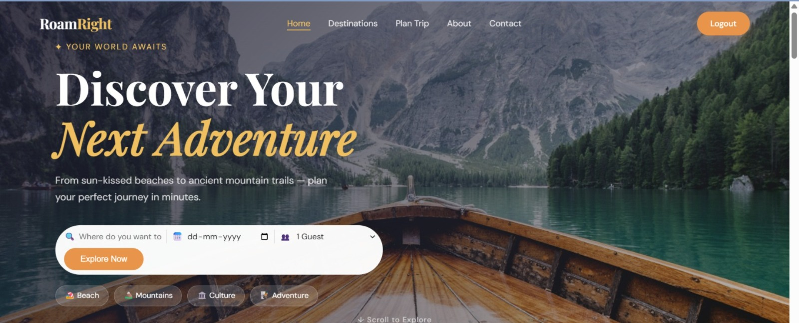
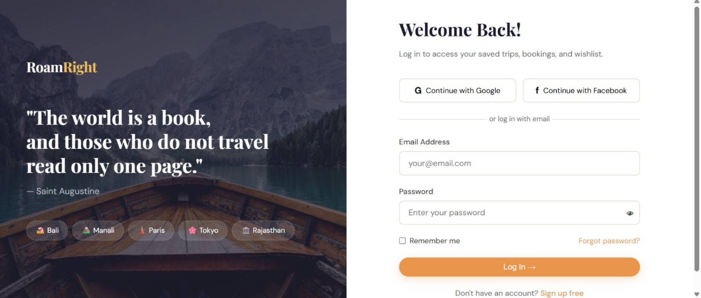
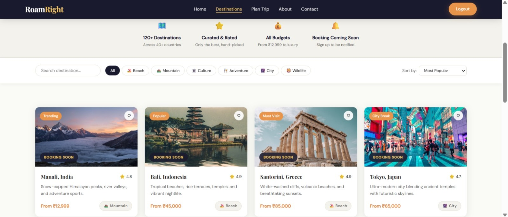
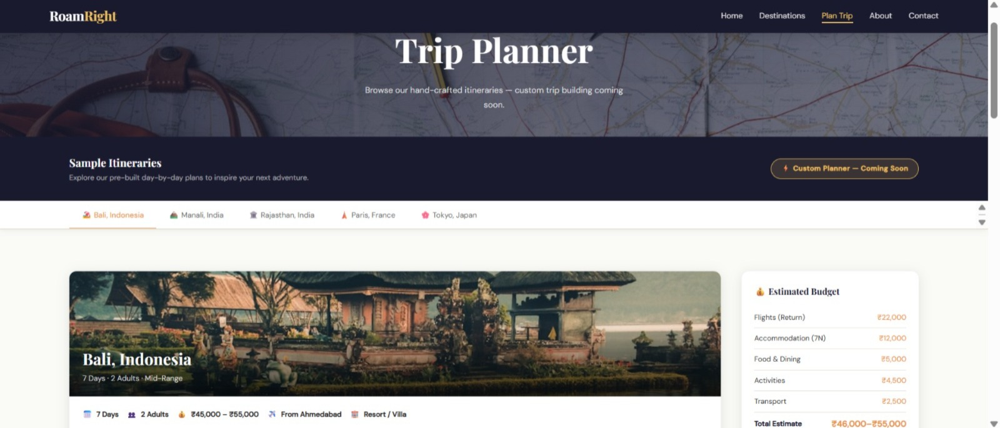
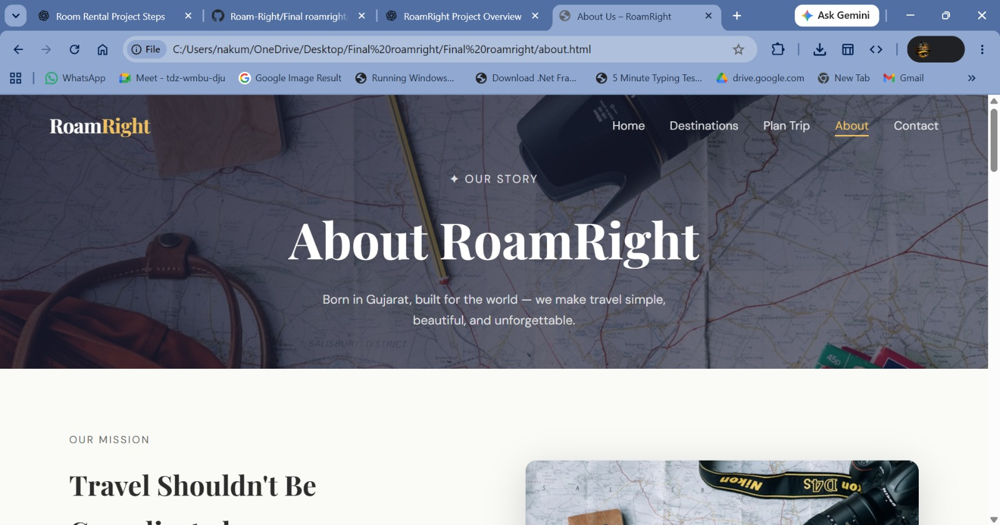
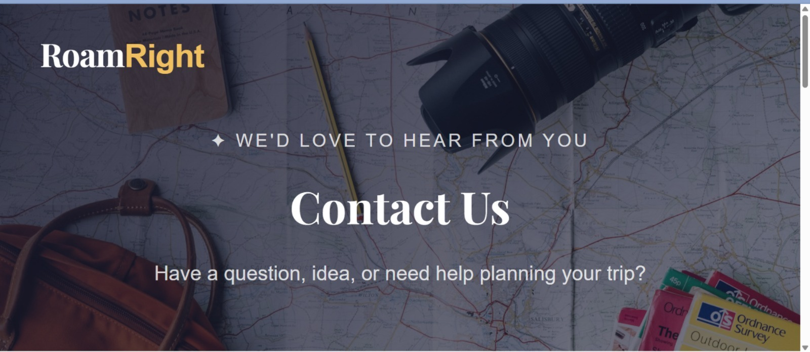

# 🌍 RoamRight – UI/UX Travel Planning Website

## 📖 About the Project

RoamRight is a **UI/UX-based travel planning website** designed to provide users with a modern, intuitive, and visually engaging experience for exploring destinations and planning trips. The project focuses on creating a clean and responsive user interface while applying user-centered design principles.

The website was designed in Figma and developed using **HTML, CSS, JavaScript, and Bootstrap**, ensuring responsiveness and accessibility across desktop, tablet, and mobile devices.

---

## ✨ Features

- 🎨 Modern UI/UX Design
- 📱 Fully Responsive Layout
- 🏠 Interactive Home Page
- 🔐 User Login Page
- 📝 User Registration Page
- 🌍 Destination Exploration
- 🔍 Search-Based Travel Planning
- 📌 Travel Categories
- ⚡ Smooth Navigation
- 💻 Cross-Browser Compatibility

---

## 🎯 UI/UX Objectives

- Create an attractive and user-friendly interface.
- Improve the travel planning experience.
- Follow modern UI/UX design principles.
- Ensure responsive design for all devices.
- Provide simple and intuitive navigation.

---

## 🛠️ Technologies Used

### UI/UX Design

- Figma

### Frontend Development

- HTML5
- CSS3
- Bootstrap 5
- JavaScript

### Version Control

- Git
- GitHub

---

## 📂 Project Pages

- Home Page
- Login Page
- Sign Up Page
- Destinations
- Plan Trip
- About
- Contact

---

## 📸 Screenshots

## 📸 Project Screenshots

  
  

  
  

  
  

### 🏠 Home Page

---

### 🔐 Login Page

---

### 🌍 Destinations Page

### 🚀 Trip Planing Page

### 🚀 About Page

### 👩‍💻 Contact Page

## 🚀 Future Enhancements

- User Dashboard
- Travel Booking System
- Hotel & Flight Search
- Wishlist Feature
- Payment Integration
- AI Travel Recommendations
- Interactive Maps

---

## 📚 Learning Outcomes

Through this project, I gained practical experience in:

- UI/UX Design Principles
- Wireframing & Prototyping
- Responsive Web Design
- HTML, CSS & Bootstrap
- JavaScript Fundamentals
- Git & GitHub
- Frontend Development Best Practices

---

## 👩‍💻 Author

**Pooja Nakum**

GitHub: https://github.com/nakumpooja

---
